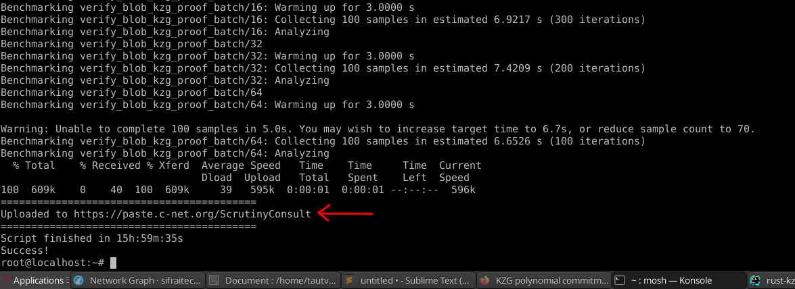
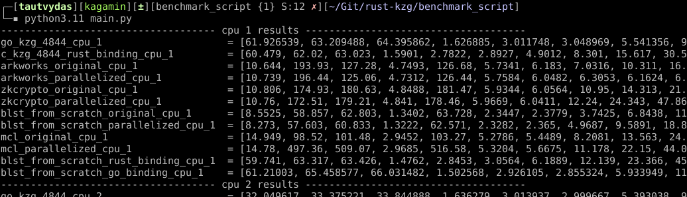
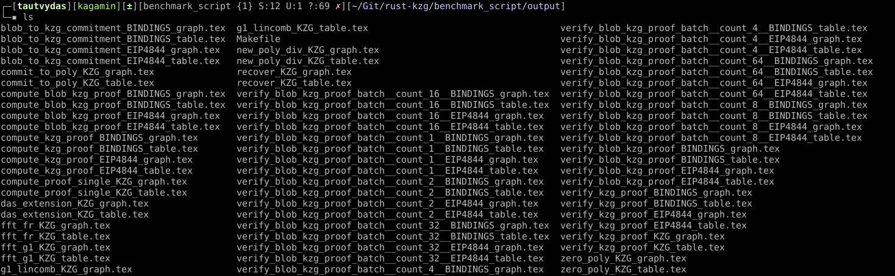
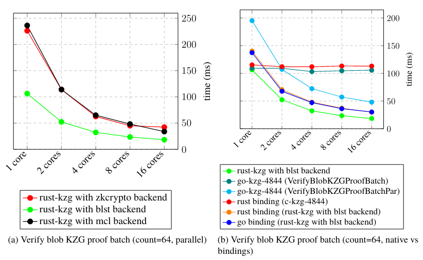

# How to produce benchmark images (on Linux)

## Prerequisites

* Python interpreter
* Package `texlive-full` (should also install `xelatex`)

## TLDR

### 1. Run the Python script

```bash
python3.11 main.py
```

that will parse the input file from the `input` directory and produce Latex files in the `output` directory.

### 2. Generate benchmark images

Inside the `output` directory, run the following command:

```bash
make all
```

## In depth

### 1. Obtain benchmark results file

1. Setup `Linode` compute instance and SSH into it
3. Clone the `rust-kzg` repository
4. Setup the server following the instructions in `run-benchmarks.sh`
5. Disconnect from the server, then connect to it again using the `Mosh` shell
6. Run `run-benchmarks.sh`



Once the script finishes running, download the results to your host machine using wget, e.g.

```bash
wget https://paste.c-net.org/ScrutinyConsult
```

Alternatives to Linode for those using Windows:

* Docker
* WSL

### 2. About benchmark results file

Inside the `input` directory, I left two files, namely `TendencyDoable-original` and `TendencyDoable-edited`. The former is what I downloaded through wget, while for the latter, I had to make slight changes. At the top of the Python script, I put this explanation: `fit rust benchmarks time into a single line separated by a whitespace`. To illustrate this change, consider the following benchmark snippet (`verify_blob_kzg_proof_batch/64` and `time:   [115.09 ms 115.26 ms 115.45 ms]` are separated by a single whitespace):

`TendencyDoable-original`:

```text
verify_blob_kzg_proof_batch/64
                        time:   [115.09 ms 115.26 ms 115.45 ms]
                        thrpt:  [554.38  elem/s 555.26  elem/s 556.07  elem/s]
Found 3 outliers among 100 measurements (3.00%)
```

`TendencyDoable-edited`:

```text
verify_blob_kzg_proof_batch/64 time:   [115.09 ms 115.26 ms 115.45 ms]
                        thrpt:  [554.38  elem/s 555.26  elem/s 556.07  elem/s]
Found 3 outliers among 100 measurements (3.00%)
```

`Rayon` doesn't have an option to fit benchmark names into a single line, so the choice is to either keep the benchmark names very small or to preprocess the benchmark results file.

### 3. The Python script

At the top of the file, define the benchmark results input file:

```text
BENCH_FILE = 'TendencyDoable-edited'
```

I use these variables

```text
RUST_KZG_BENCH_COUNT = 21  # -2 fk20 benchmarks
GO_KZG_BENCH_COUNT = 19
OTHER_BENCH_COUNT = 12
```

to check that every array that I append the parsed results to, such as `c_kzg_4844_rust_binding_cpu_1 = []`, has a predefined amount of results and to figure out which array to append these results to.

At line 678 and forward, you'll find this big chunk of comment that begins like this:

```text
* go-kzg-4844   = [
    [0]  Benchmark/BlobToKZGCommitment
    [1]  Benchmark/ComputeKZGProof
    [2]  Benchmark/ComputeBlobKZGProof
```

where `[0]`, `[1]`, etc., is what I pass to functions, such as

```
make_rust_kzg_latex_from_data("das_extension", "KZG", "ms", 0,        index=0)
```

to denote at which array position (index) results of the same type are, because benchmarks in rust-kzg, go-kzg-4844, and c-kzg-4844 don't appear in the same order in the input file; they even begin with different names.

That's the gist of the Python script. Once you run it, you'll see the following output:



It's important that the array values match the content of the benchmark results input file.

### 4. Benchmark images

The Python script will generate all these Latex files in the `output` directory. We then use `Makefile` and `xelatex` to render them:



### 5. Side-by-side benchmark images

In order to generate side-by-side graphs like this:



I used the following Latex code:

```latex
\begin{figure}[h]
    \centering
    \hspace*{-1cm}\subfloat[][Verify blob KZG proof batch (count=64, parallel)]{\resizebox{0.55\textwidth}{!}{
%----------------------------------------------------------------------
\begin{tikzpicture}
  \begin{axis}[
      legend style={at={(0.5, -0.3)}, anchor=north, legend cell align=left},
      symbolic x coords={1 core, 2 cores, 4 cores, 8 cores, 16 cores},
      xtick=data,
      x tick label style={rotate=45, anchor=east},
      ymin=0, ymax=259.666, %%% change this
      ylabel near ticks,
      yticklabel pos=right,
      ylabel={time (ms)}, %%% change this
      grid = major,
      grid style=dashed,
  ]
   %%% rust-kzg with zkcrypto backend
   \addlegendentry{rust-kzg with zkcrypto backend}
   \addplot[mark=*, mark options={scale=1.5}, thick, red] coordinates {
      (1 core,   226.01)
      (2 cores,  114.01)
      (4 cores,  62.622)
      (8 cores,  45.076)
      (16 cores, 42.269) };
   %%% rust-kzg with blst backend
   \addlegendentry{rust-kzg with blst backend}
   \addplot[mark=*, mark options={scale=1.5}, thick, green] coordinates {
      (1 core,   106.29)
      (2 cores,  52.307)
      (4 cores,  32.279)
      (8 cores,  23.525)
      (16 cores, 18.397) };
   %%% rust-kzg with mcl backend
   \addlegendentry{rust-kzg with mcl backend}
   \addplot[mark=*, mark options={scale=1.5}, thick, black] coordinates {
      (1 core,   236.06)
      (2 cores,  113.92)
      (4 cores,  65.031)
      (8 cores,  48.163)
      (16 cores, 33.903) };

\end{axis}
\end{tikzpicture}
%----------------------------------------------------------------------
    }}
    % A blank line here like a new paragraph so next picture is placed below
    \subfloat[][Verify blob KZG proof batch (count=64, native vs bindings)]{\resizebox{0.5\textwidth}{!}{
%----------------------------------------------------------------------
\begin{tikzpicture}
  \begin{axis}[
      legend style={at={(0.5, -0.3)}, anchor=north, legend cell align=left},
      symbolic x coords={1 core, 2 cores, 4 cores, 8 cores, 16 cores},
      xtick=data,
      x tick label style={rotate=45, anchor=east},
      ymin=0, ymax=214.7225861, %%% change this
      ylabel near ticks,
      yticklabel pos=right,
      ylabel={time (ms)}, %%% change this
      grid = major,
      grid style=dashed,
  ]
  %%% rust-kzg with blst backend
  \addlegendentry{rust-kzg with blst backend}
  \addplot[mark=*, mark options={scale=1.5}, thick, green] coordinates {
      (1 core,   106.29)
      (2 cores,  52.307)
      (4 cores,  32.279)
      (8 cores,  23.525)
      (16 cores, 18.397) };
   %%% go-kzg-4844 (VerifyBlobKZGProofBatch)
   \addlegendentry{go-kzg-4844 (VerifyBlobKZGProofBatch)}  % TODO: pick new name
   \addplot[mark=*, mark options={scale=1.5}, thick, teal] coordinates {
      (1 core,   109.274459)
      (2 cores,  109.117014)
      (4 cores,  103.164998)
      (8 cores,  104.680149)
      (16 cores, 105.648774) };
   %%% go-kzg-4844 (VerifyBlobKZGProofBatchPar)
   \addlegendentry{go-kzg-4844 (VerifyBlobKZGProofBatchPar)}  % TODO: pick new name
   \addplot[mark=*, mark options={scale=1.5}, thick, cyan] coordinates {
      (1 core,   195.202351)
      (2 cores,  107.22205)
      (4 cores,  72.424288)
      (8 cores,  57.183459)
      (16 cores, 48.036951) };
   %%% rust binding (c-kzg-4844)
  \addlegendentry{rust binding (c-kzg-4844)}
  \addplot[mark=*, mark options={scale=1.5}, thick, red] coordinates {
      (1 core,   115.26)
      (2 cores,  112.03)
      (4 cores,  111.98)
      (8 cores,  113.25)
      (16 cores, 113.08) };
   %%% rust binding (rust-kzg with blst backend)
   \addlegendentry{rust binding (rust-kzg with blst backend)}
   \addplot[mark=*, mark options={scale=1.5}, thick, orange] coordinates {
      (1 core,   140.33)
      (2 cores,  70.553)
      (4 cores,  47.982)
      (8 cores,  36.909)
      (16 cores, 29.82) };
   %%% go binding (rust-kzg with blst backend)
   \addlegendentry{go binding (rust-kzg with blst backend)}
   \addplot[mark=*, mark options={scale=1.5}, thick, blue] coordinates {
      (1 core,   137.332656)
      (2 cores,  67.693732)
      (4 cores,  47.14144)
      (8 cores,  36.172303)
      (16 cores, 30.163846) };

\end{axis}
\end{tikzpicture}
%----------------------------------------------------------------------
    }}
    \caption{Performance comparison of verify blob KZG proof batch (count=64)}
    \end{figure}
```

`\hspace*{-1cm}` and `\resizebox{0.55\textwidth}` play a role here, so be sure to experiment with these two.
