# Parallelized multi-backend KZG library for Ethereum Data Sharding (aka Proto-Danksharding, EIP-4844)

The goal is to create a parallelized KZG library for Ethereum Data Sharding (aka Proto-Danksharding, EIP-4844) that supports multiple ECC (Elliptic-curve cryptography) backend libraries.

# Backend ECC libraries

Support for multiple backend ECC libraries is implemented via [Traits](https://github.com/grandinetech/kzg/blob/main/kzg/src/lib.rs). Such an approach allows to easy change backend ECC libraries as all the crates shared the same interface (see [benchmarks](https://github.com/grandinetech/kzg/tree/main/kzg-bench/src/benches) and [tests](https://github.com/grandinetech/kzg/tree/main/kzg-bench/src/tests)). The current state of supported backend ECC libraries:

| Backend ECC | FFT/DAS | EIP-4844 (non-parallel) | EIP-4844 (parallel) | [c-kzg-4844](https://github.com/ethereum/c-kzg-4844) drop-in replacement | GPU acceleration |
| :---: | :---: | :---: | :---: | :---: | :---: |
| [blst](https://github.com/supranational/blst) | :heavy_check_mark: | :heavy_check_mark: | :heavy_check_mark: | :heavy_check_mark: | :heavy_check_mark: via [sppark](https://github.com/supranational/sppark) |
| [constantine](https://github.com/mratsim/constantine) | :heavy_check_mark: | :heavy_check_mark: | :heavy_check_mark: | :heavy_check_mark: | :x: |
| [mcl](https://github.com/herumi/mcl) | :heavy_check_mark: | :heavy_check_mark: | :heavy_check_mark: | :heavy_check_mark: | :x: |
| [arkworks5](https://github.com/arkworks-rs/algebra/tree/v0.5.0) | :heavy_check_mark: | :heavy_check_mark: | :heavy_check_mark: | :heavy_check_mark: | :x: |
| [arkworks4](https://github.com/arkworks-rs/algebra/tree/v0.4.2) | :heavy_check_mark: | :heavy_check_mark: | :heavy_check_mark: | :heavy_check_mark: | :x: |
| [arkworks3](https://github.com/arkworks-rs/algebra/tree/v0.3.0) | :heavy_check_mark: | :heavy_check_mark: | :heavy_check_mark: | :heavy_check_mark: | :heavy_check_mark: via [sppark](https://github.com/supranational/sppark) and [wlc_msm](https://github.com/dunkirkturbo/wlc_msm/tree/master) | 
| [zkcrypto](https://github.com/zkcrypto/bls12_381) | :heavy_check_mark: | :heavy_check_mark: | :heavy_check_mark: | :heavy_check_mark: | :x: |

## Additional setup steps for ECC libraries

* For all backends:
    1. Set up rust. Only latest rust version is tested on CI, so it is better to use this one.
    2. C/C++ compiler:
        * Debian/Ubuntu: `sudo apt update && sudo apt install build-essential`
        * Archlinux: `pacman -S base-devel`
        * Windows: rustup automatically sets up [visual studio C++ compiler](https://visualstudio.microsoft.com/vs/features/cplusplus/), make sure it is present.
* For `constantine`:
    1. Set up nim. It is recommended to use [`choosenim`](https://github.com/nim-lang/choosenim), and set up `2.0.2` nim version.
    2. Clang compiler:
        * Debian/Ubuntu: `sudo apt update && sudo apt install clang`
        * Archlinux: `pacman -S clang`
        * Windows: you can install "C++ Clang tools for Windows" from visual studio installer
* For `mcl`:
    1. GMP:
        * Debian/Ubuntu: `sudo apt instal libgmp-dev`
        * MacOS: `brew install gmp`

`blst`, `arkworks3`, `arkworks4`, `arkworks5` and `zkcrypto` do not require additional setup steps.

# Drop-in replacement for c-kzg-4844

We aim to expose [an identical C interface](https://github.com/grandinetech/rust-kzg/blob/ca976958e270cd24248a5ab0355b03702f7ae142/blst/src/eip_4844.rs#L53-L412) compared to [c-kzg-4844](https://github.com/ethereum/c-kzg-4844) so that `rust-kzg` could work as a drop-in replacement for c-kzg-4844. If you already use [c-kzg-4844 bindings](https://github.com/ethereum/c-kzg-4844/tree/main/bindings) you can try faster parallelized `rust-kzg` without any changes to your code-base by simply replacing the binary. Instructions for C#, Java, Nodejs, Python, Rust bindings are available [here](https://github.com/grandinetech/rust-kzg/blob/main/blst/run-c-kzg-4844-tests.sh).

By default, C bindings are disabled. To enable them, compile static library with feature flag `c_bindings`:
```
cargo rustc -p rust-kzg-blst --release --crate-type=staticlib --features=c_bindings
```

# Multi-scalar multiplication

Multiple multi-scalar multiplication algorithms are [implemented](https://github.com/grandinetech/rust-kzg/tree/main/kzg/src/msm) in the library. Most of them are ECC backend agnostic and have both sequential and parallel versions.

# Example

The best place to look for examples is [tests](https://github.com/grandinetech/kzg/tree/main/kzg-bench/src/tests) directory.

Currently, the ECC backend is set by pointing Cargo to the corresponding crate:

```
[dependencies]
kzg = { git = "https://github.com/grandinetech/rust-kzg.git", package = "rust-kzg-blst" }
kzg_traits = { git = "https://github.com/grandinetech/rust-kzg.git", package = "kzg" }
```

# Benchmarks

Benchmarks [run](https://github.com/grandinetech/kzg/blob/main/.github/workflows/benchmarks.yml) on every Github build. However, it's best to run them on a dedicated machine. [Tautvydas](https://github.com/belijzajac) rendered nice charts for results he got on cloud servers:

## Blob to KZG commitment

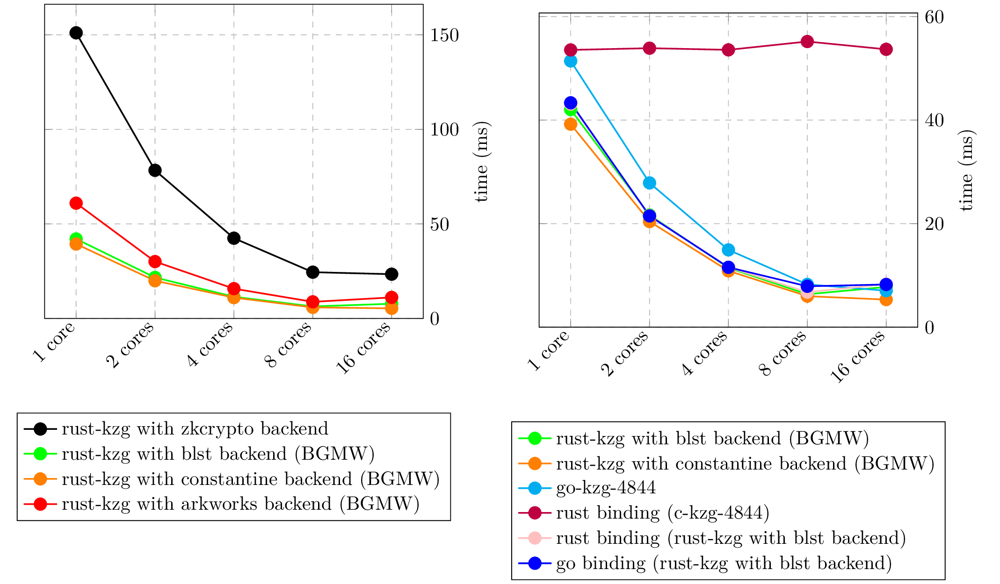

## Compute KZG proof

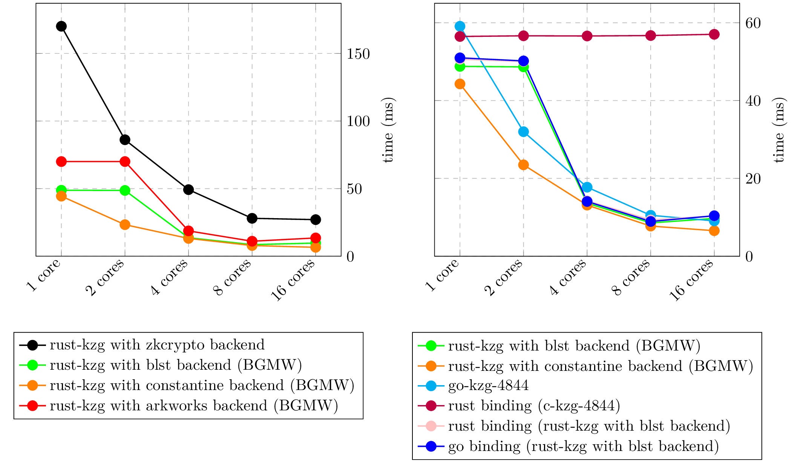

## Verify KZG proof

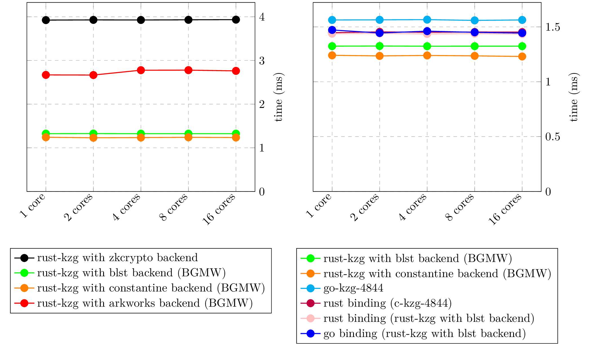

## Compute blob KZG proof

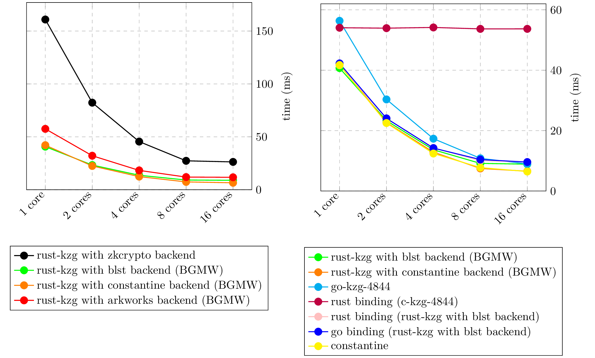

## Verify blob KZG proof

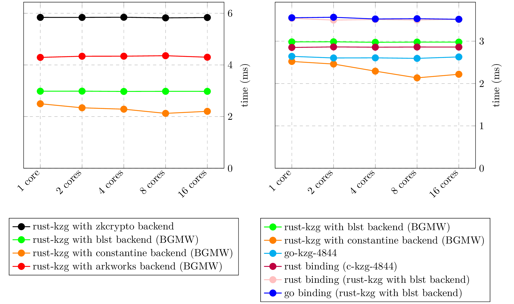

## Verify blob KZG proof batch

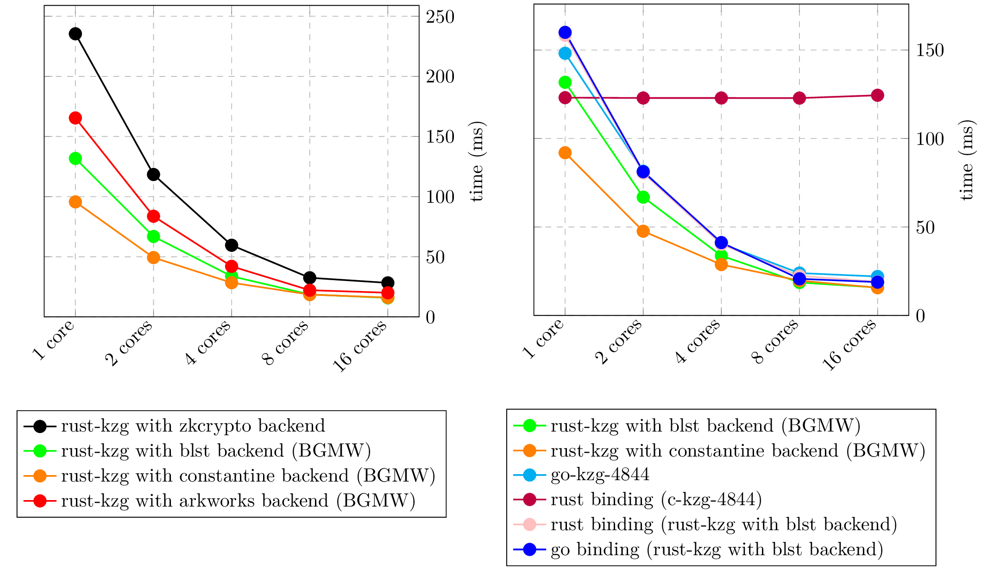

<details>
<summary>Click to expand (blobs count 32 to 1)</summary>

## Verify blob KZG proof batch (count 32)

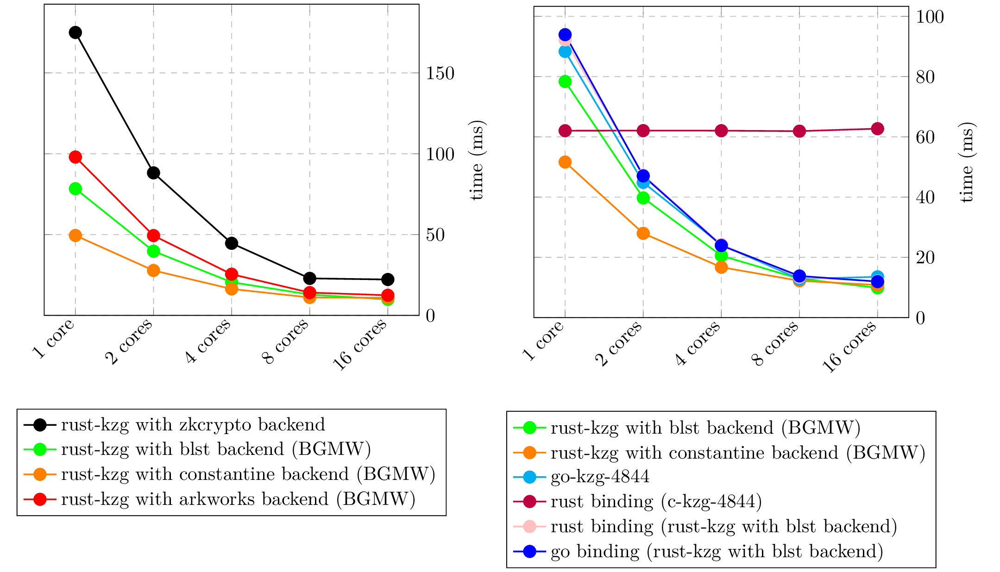

## Verify blob KZG proof batch (count 16)

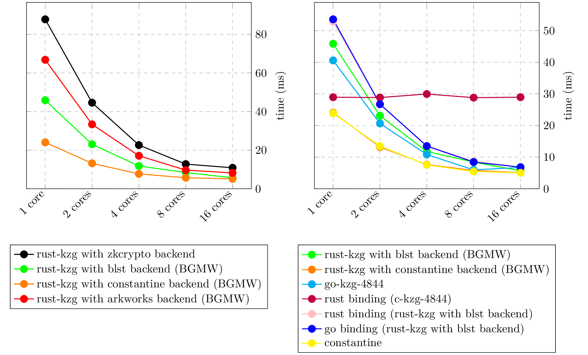

## Verify blob KZG proof batch (count 8)

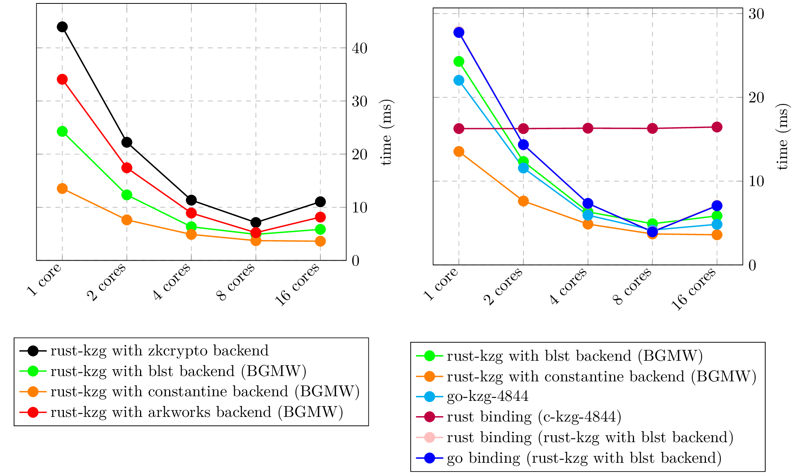

## Verify blob KZG proof batch (count 4)

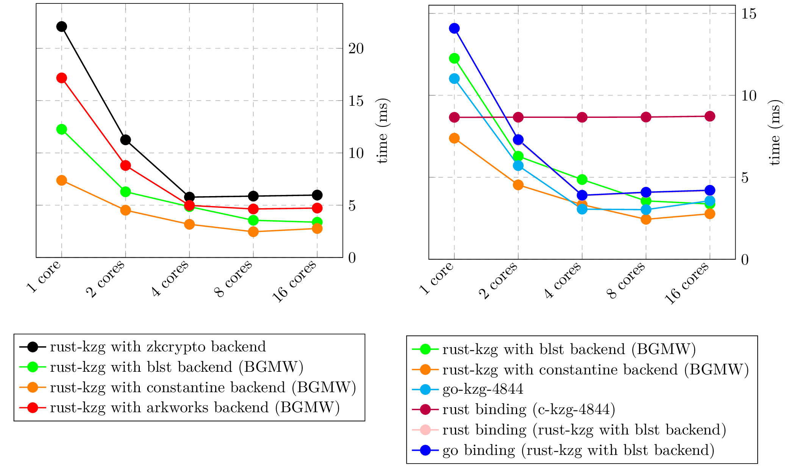

## Verify blob KZG proof batch (count 2)


## Verify blob KZG proof batch (count 1)

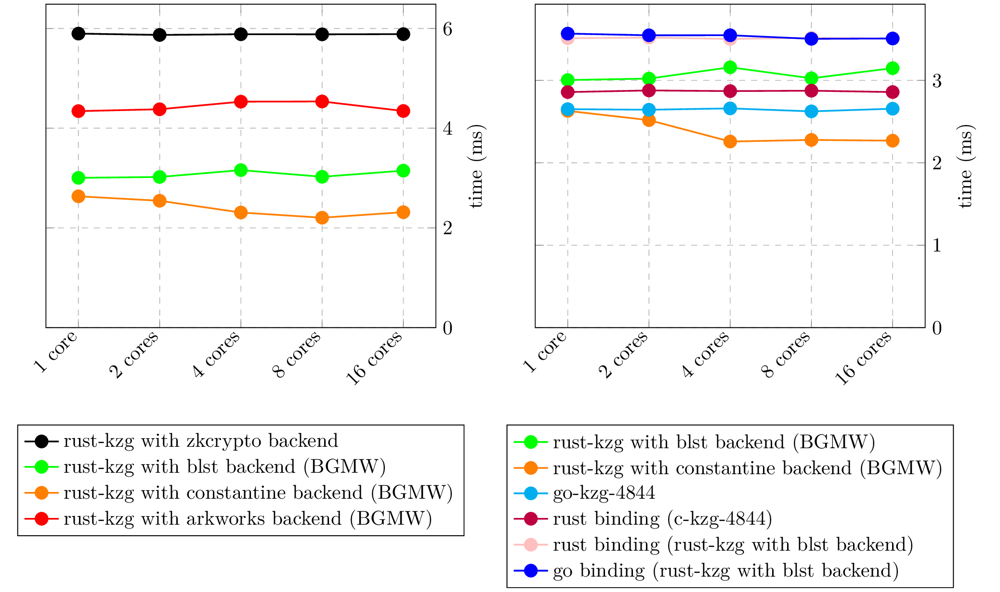

</details>

## Fast Fourier transform (FFT)

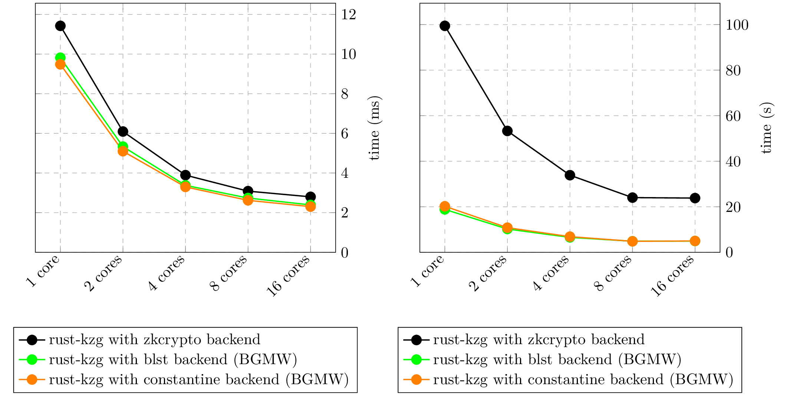

## Multi-scalar multiplication (MSM)

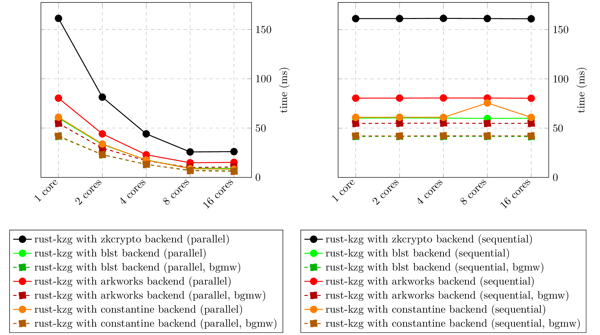

# GPU acceleration

GPU-accelerated multi-scalar multiplication is available for `arkworks3` and `blst` backends.

## Multi-scalar multiplication

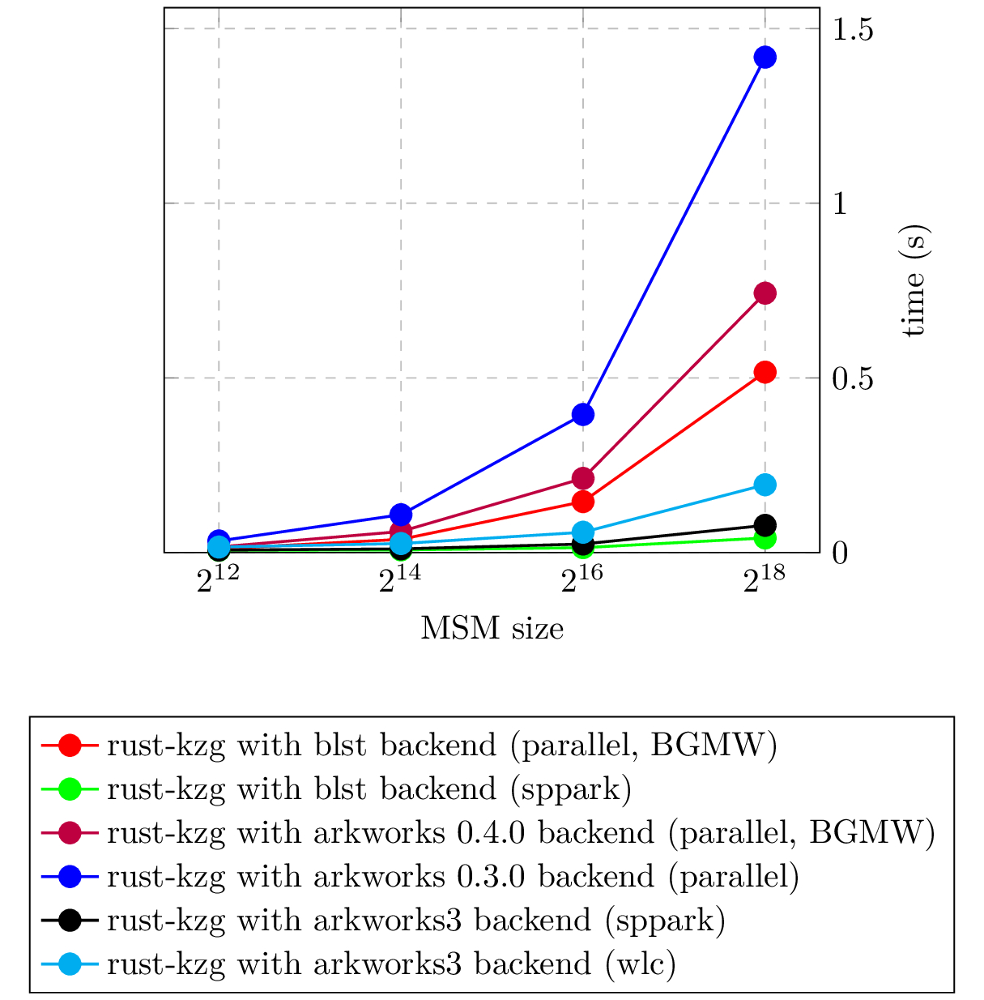

## Blob to KZG commitment


## Compute KZG proof

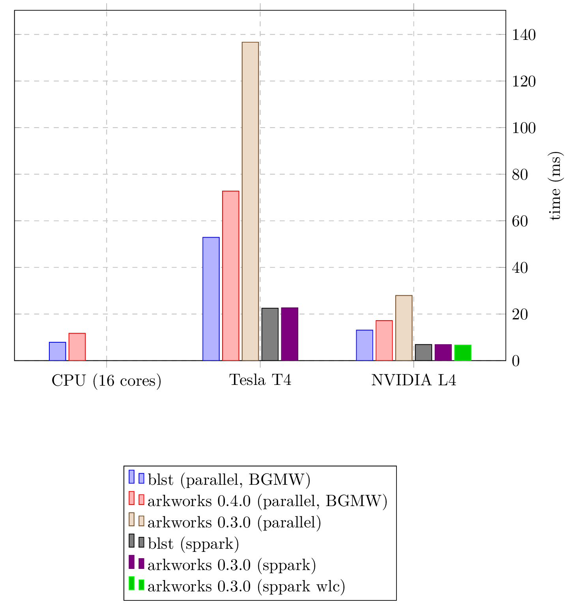

## Compute blob KZG proof

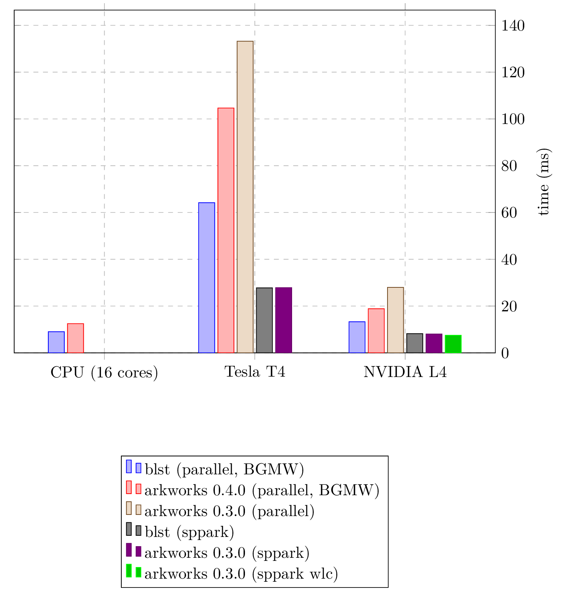

# Authors

The project is developed [numerous contributors](https://github.com/grandinetech/rust-kzg/graphs/contributors) led by [Saulius Grigaitis](https://twitter.com/sauliuseth). The project is heavily based on the [c-kzg-4844](https://github.com/ethereum/c-kzg-4844), [c-kzg](https://github.com/benjaminion/c-kzg), [go-kzg](https://github.com/protolambda/go-kzg), and other libraries.
