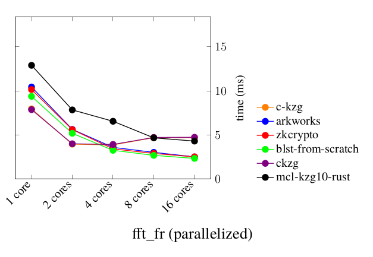
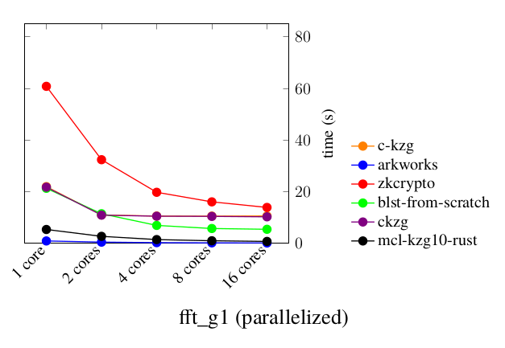
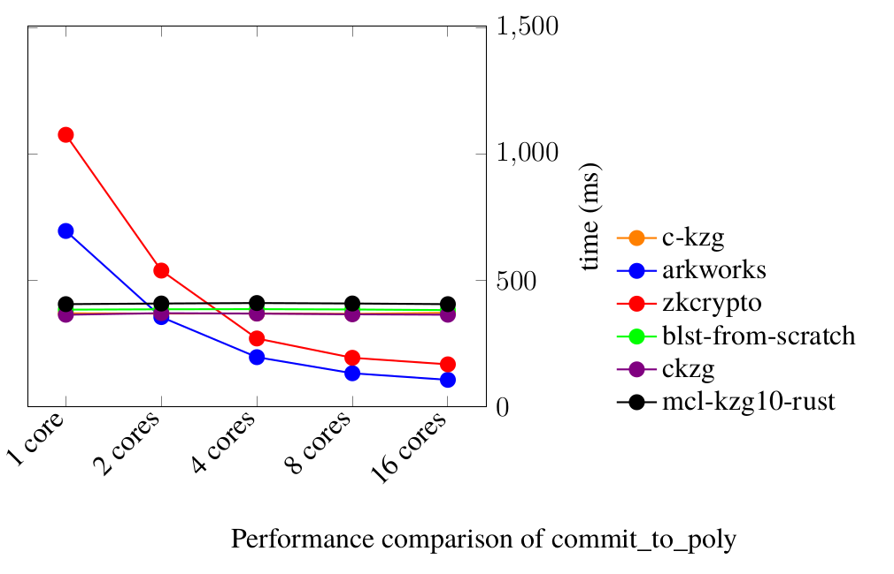
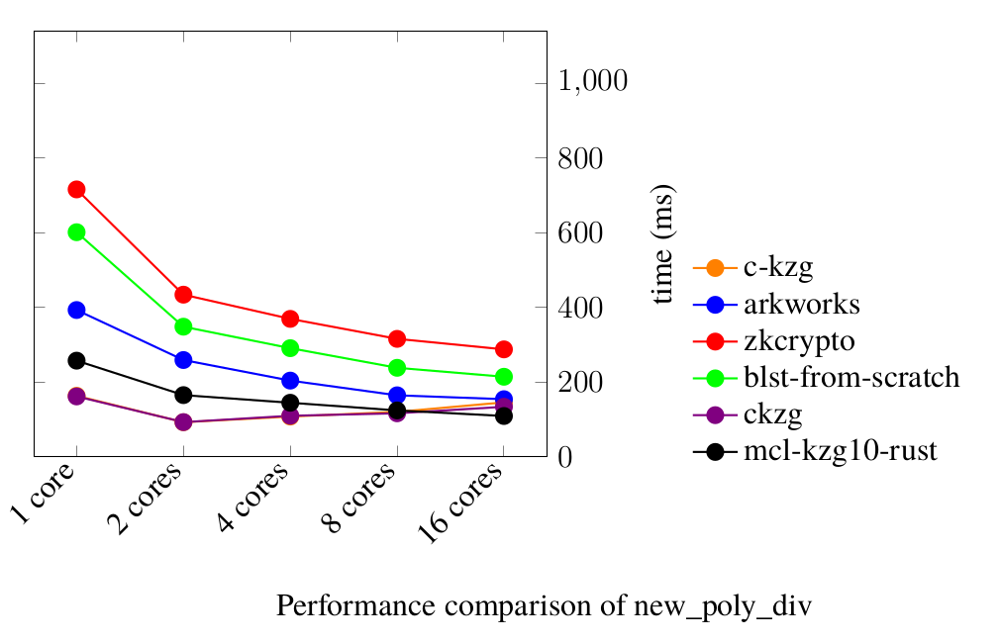
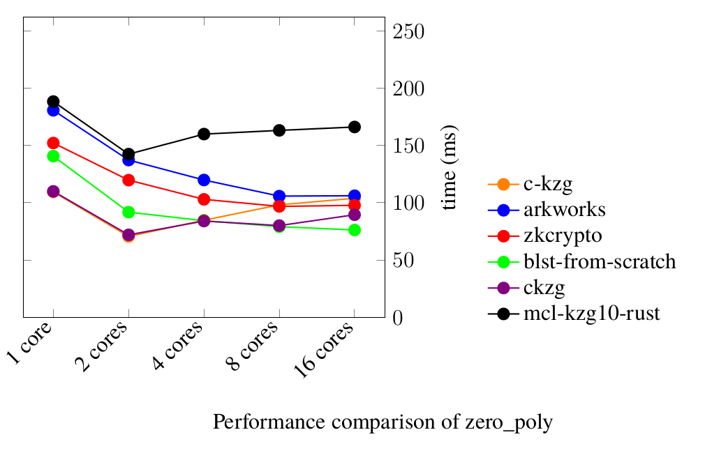
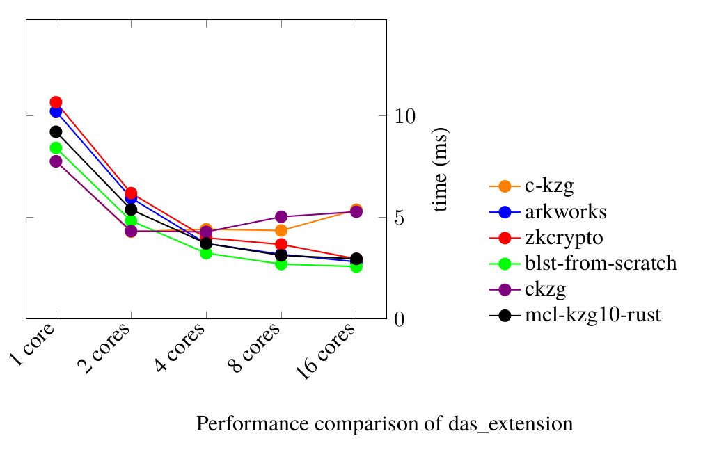
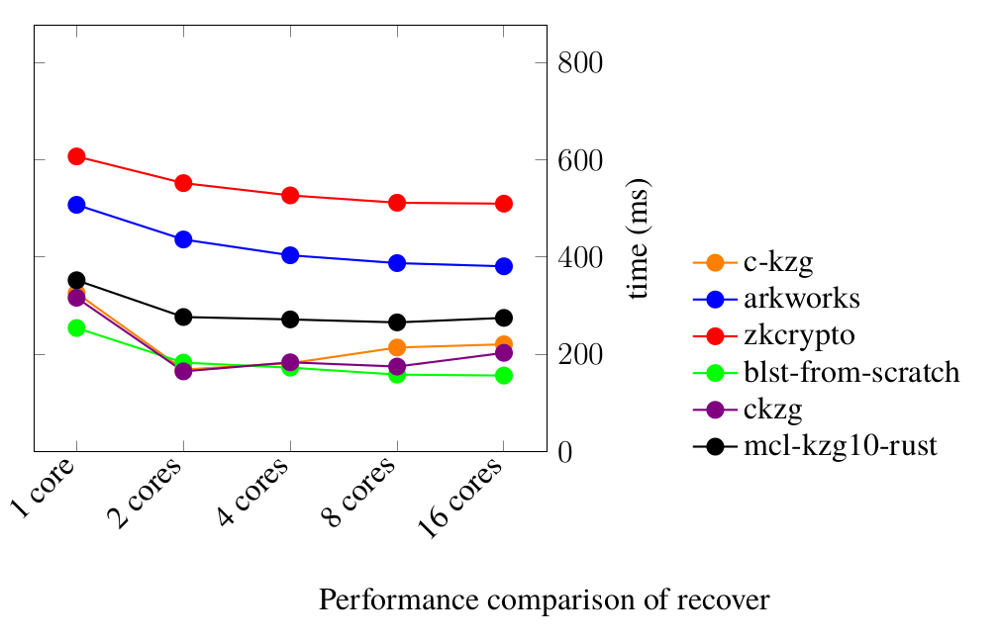

# Parallelized multi-backend KZG library for Ethereum Data Sharding (aka Proto-Danksharding, EIP-4844)

The goal is to create a parallelized KZG library for Ethereum Data Sharding (aka Proto-Danksharding, EIP-4844) that supports multiple ECC (Elliptic-curve cryptography) backend libraries.

# Backend ECC libraries

Support for multiple backend ECC libraries is implemented via [Traits](https://github.com/sifraitech/kzg/blob/main/kzg/src/lib.rs). Such an approach allows to easily change backend ECC libraries in a way that is done in [benchmarks](https://github.com/sifraitech/kzg/tree/main/kzg-bench/src/benches) and [tests](https://github.com/sifraitech/kzg/tree/main/kzg-bench/src/tests). List of different backend ECC libraries:

* Arkworks - Rust implementation using [akrworks](https://github.com/arkworks-rs);
* blst-from-scratch - Rust implementation using [blst](https://github.com/supranational/blst);
* ckzg - bindings for [c-kzg](https://github.com/benjaminion/c-kzg) that uses [blst](https://github.com/supranational/blst);
* mcl-kzg - Rust implementation using [mcl](https://github.com/herumi/mcl);
* zkcrypto - Rust implementation using [zkcrypto](https://github.com/zkcrypto).

# Benchmarks

Benchmarks [run](https://github.com/sifraitech/kzg/blob/main/.github/workflows/benchmarks.yml) on every Github build. However, it's best to run it on a dedicated machine. [Tautvydas](https://github.com/belijzajac) rendered nice charts for results he got on cloud servers:

Some results are weird and needs to be double-checked.

# Authors

The project is mainly developed by a group of students at the Blockchain Technologies course led by [Saulius Grigaitis](https://twitter.com/sauliuseth). The project is heavily based on the [go-kzg](https://github.com/protolambda/go-kzg), [c-kzg](https://github.com/benjaminion/c-kzg), and other libraries.
