# Parallelized multi-backend KZG library for Ethereum Data Sharding (aka Proto-Danksharding, EIP-4844)

The goal is to create a parallelized KZG library for Ethereum Data Sharding (aka Proto-Danksharding, EIP-4844) that supports multiple ECC (Elliptic-curve cryptography) backend libraries.

# Backend ECC libraries

Support for multiple backend ECC libraries is implemented via [Traits](https://github.com/sifraitech/kzg/blob/main/kzg/src/lib.rs). Such an approach allows to easy change backend ECC libraries as all the crates shared the same interface (see [benchmarks](https://github.com/sifraitech/kzg/tree/main/kzg-bench/src/benches) and [tests](https://github.com/sifraitech/kzg/tree/main/kzg-bench/src/tests)). The current state of supported backend ECC libraries:

| Backend ECC | FFT/DAS | EIP-4844 (non-parallel) | EIP-4844 (parallel) | [c-kzg-4844](https://github.com/ethereum/c-kzg-4844) drop-in replacement | GPU acceleration |
| :---: | :---: | :---: | :---: | :---: | :---: |
| [blst](https://github.com/supranational/blst) | :heavy_check_mark: | :heavy_check_mark: | :heavy_check_mark: | :heavy_check_mark: | :heavy_check_mark: via [sppark](https://github.com/supranational/sppark) |
| [constantine](https://github.com/mratsim/constantine) | :heavy_check_mark: | :heavy_check_mark: | :heavy_check_mark: | :heavy_check_mark: | :x: |
| [mcl](https://github.com/herumi/mcl) | :heavy_check_mark: | :heavy_check_mark: | :heavy_check_mark: | :x: | :x: |
| [arkworks](https://github.com/arkworks-rs/algebra) | :heavy_check_mark: | :heavy_check_mark: | :heavy_check_mark: | :heavy_check_mark: | :x: |
| [arkworks3](https://github.com/arkworks-rs/algebra/tree/v0.3.0) | :heavy_check_mark: | :heavy_check_mark: | :heavy_check_mark: | :heavy_check_mark: | :heavy_check_mark: via [sppark](https://github.com/supranational/sppark) and [wlc_msm](https://github.com/dunkirkturbo/wlc_msm/tree/master) | 
| [zkcrypto](https://github.com/zkcrypto/bls12_381) | :heavy_check_mark: | :heavy_check_mark: | :heavy_check_mark: | :heavy_check_mark: | :x: |


# Drop-in replacement for c-kzg-4844

We aim to expose [an identical C interface](https://github.com/sifraitech/rust-kzg/blob/b4de1923a6218ea37021d0f9e3bd375dbf529d34/blst-from-scratch/src/eip_4844.rs#L604:L835) compared to [c-kzg-4844](https://github.com/ethereum/c-kzg-4844) so that `rust-kzg` could work as a drop-in replacement for c-kzg-4844. If you already use [c-kzg-4844 bindings](https://github.com/ethereum/c-kzg-4844/tree/main/bindings) you can try faster paralellized `rust-kzg` without any changes to your code-base by simply replacing the binary. Instructions for C#, Java, Nodejs, Python, Rust bindings are available [here](https://github.com/sifraitech/rust-kzg/blob/main/blst/run-c-kzg-4844-tests.sh).

# Example

The best place to look for examples is [tests](https://github.com/sifraitech/kzg/tree/main/kzg-bench/src/tests) directory.

Currently, the ECC backend is set by pointing Cargo to the corresponding crate:

```
[dependencies]
kzg = { git = "https://github.com/sifraitech/rust-kzg.git", package = "rust-kzg-blst" }
kzg_traits = { git = "https://github.com/sifraitech/rust-kzg.git", package = "kzg" }
```

# Benchmarks

Benchmarks [run](https://github.com/sifraitech/kzg/blob/main/.github/workflows/benchmarks.yml) on every Github build. However, it's best to run them on a dedicated machine. [Tautvydas](https://github.com/belijzajac) rendered nice charts for results he got on cloud servers:

## Blob to KZG commitment

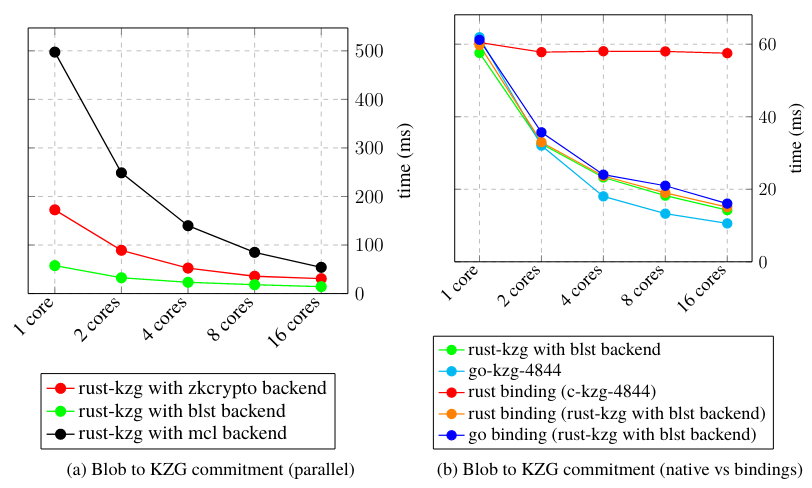

## Compute KZG proof

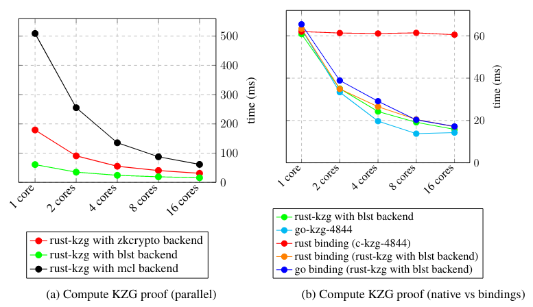

## Verify KZG proof

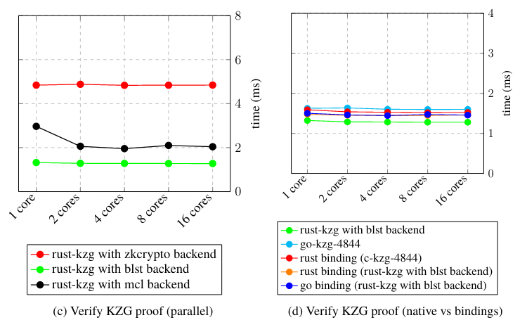

## Compute blob KZG proof

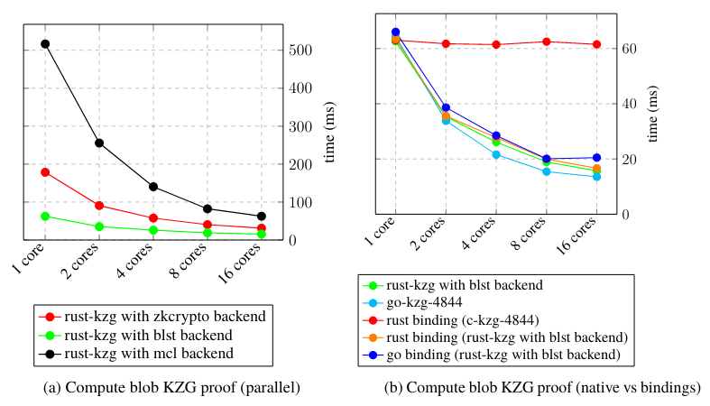

## Verify blob KZG proof

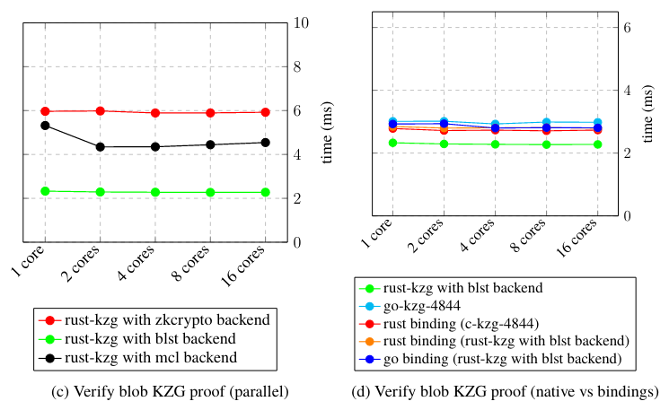

## Verify blob KZG proof batch


<details>
<summary>Click to expand (blobs count 32 to 1)</summary>

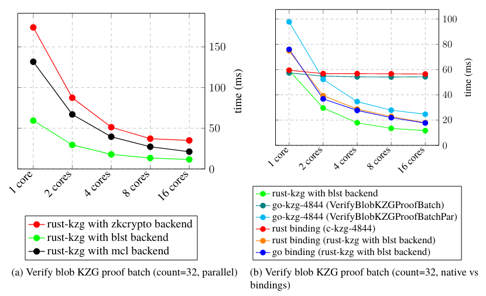

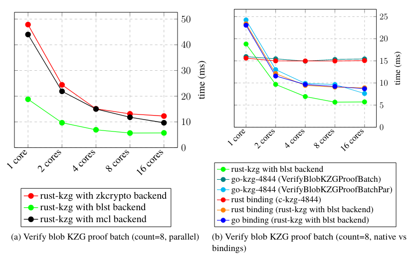
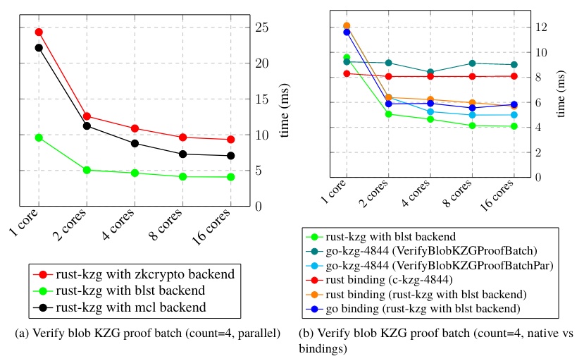
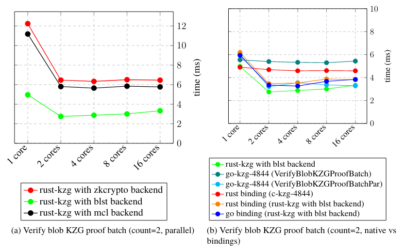
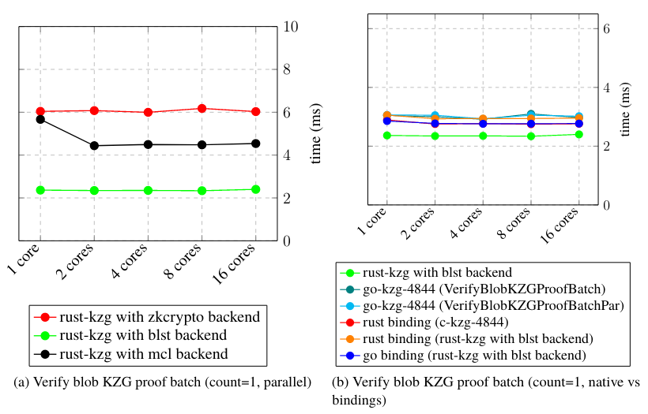

</details>

## Fast Fourier transform (FFT)

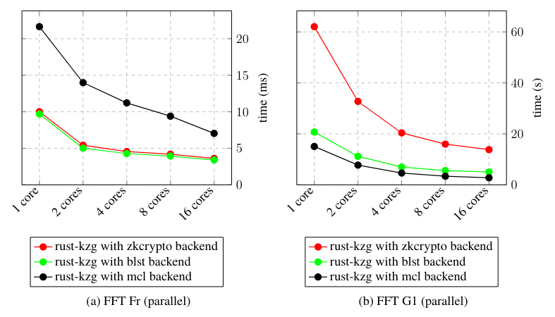

## Multi-scalar multiplication (MSM)

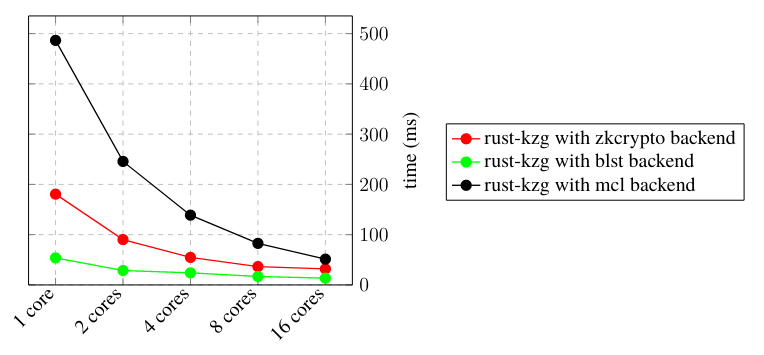

# Authors

The project is mainly developed by a group of students at the Blockchain Technologies course led by [Saulius Grigaitis](https://twitter.com/sauliuseth). The project is heavily based on the [go-kzg](https://github.com/protolambda/go-kzg), [c-kzg](https://github.com/benjaminion/c-kzg), and other libraries.
